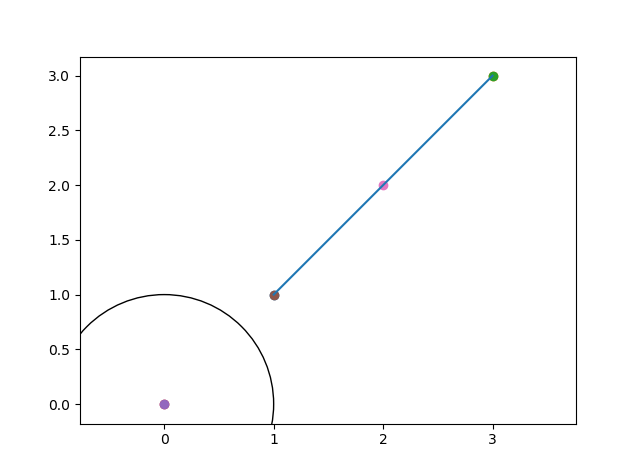
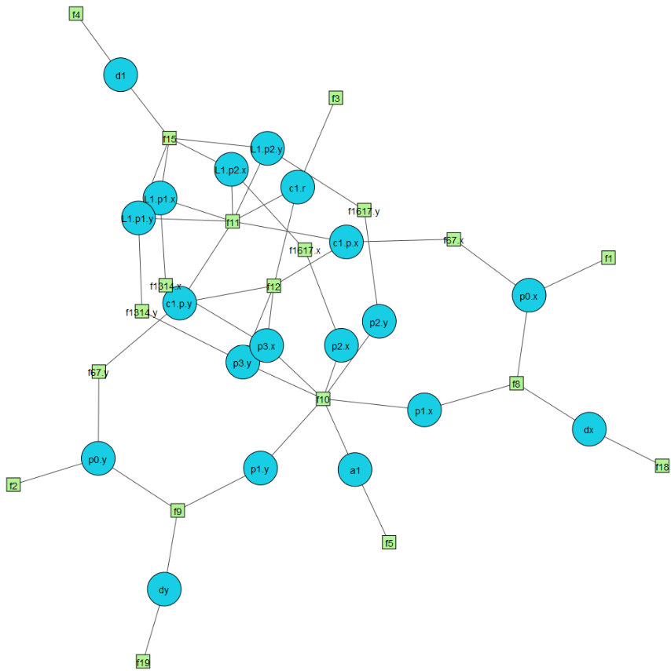
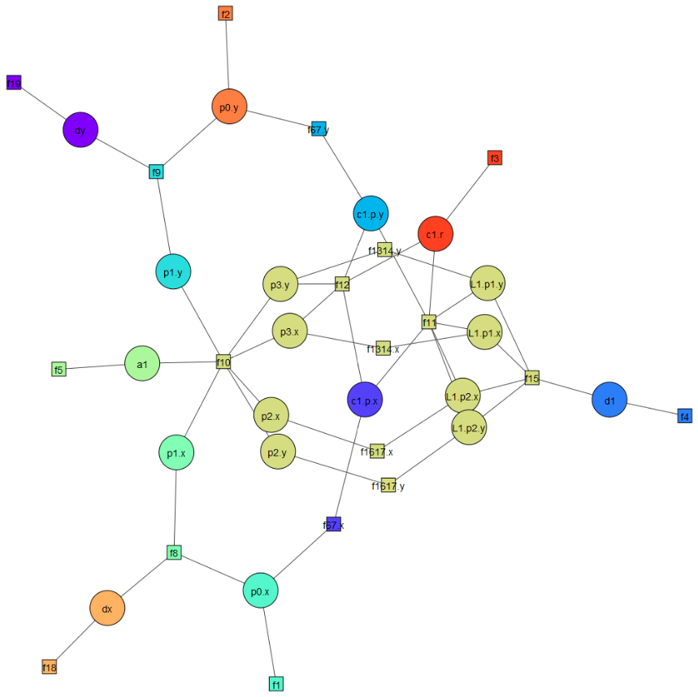
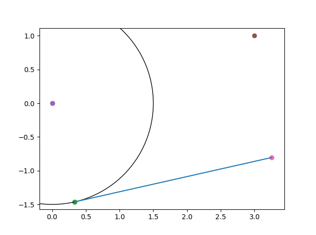
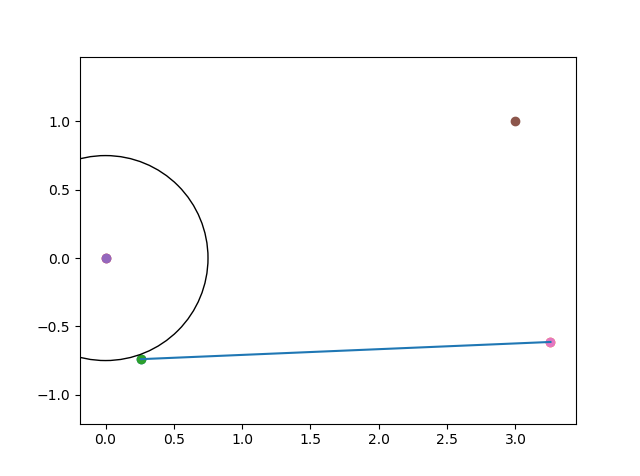

# constraint-solver

Pure python geometric constraint solver

`import gcs`

See `gcs/solve_elements.py` for a description of the
mechanics behind this package. Essentially, gcs implements
a constraint solver that breaks a problem into fully 
constrained sets of equations/variables and solves each
set in order of its graph dependencies.

This algorithm was loosely inspired by some light research
I did on CAD constraint solvers, but the idea to split
equations/constraints into fully constrained sets was
original.

## Installing

This repo contains conda environment definitions that
work with this package (`environment.yml` and
`environment-windows.yml`).

To install on windows (remove `sh` if not using bash and
use `create-windows-env.bat`):

```bash
sh create_windows-env.sh
pip install -e .
```

## Running

A couple sample scripts exist in `test/`.

- `test/make_constraint_graph.py`: shows how to set up a
solver, solve it, and view its geometry and constraint graph
- `test/problem2_cstr_del_add`: tests adding/deleting constraints
on a sample problem. Makes an mpl animation showing the solver
being updated as the constraint controlling the circle's radius
changes

### Sample Results

Geometry for problem2:



Constraint graph before running gcs algorithm:



Constraint graph split into fully constrained sets:



Solved problem2:



Re-solved after point-on-circle constraint removed
and circle radius changed:

